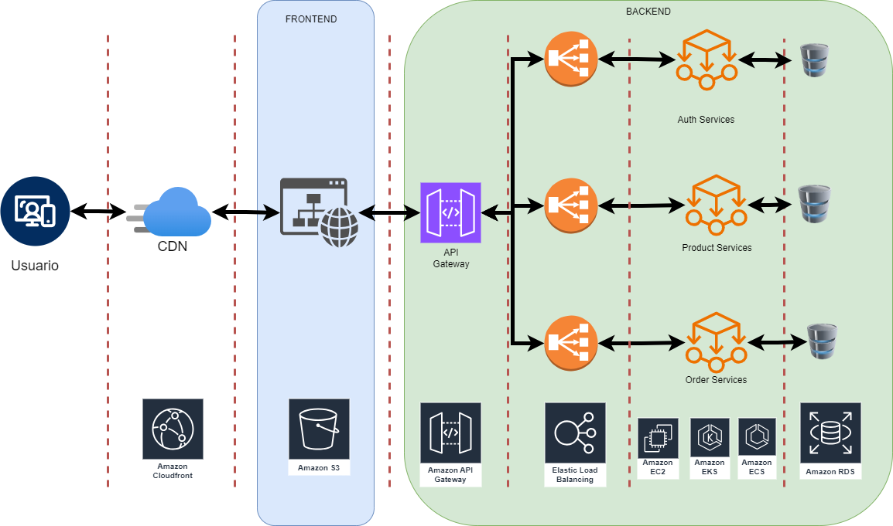

# Proyecto Ecommerce Microservices

## Descripción

Este proyecto es una prueba técnica que implementa un sistema de ecommerce utilizando una arquitectura de microservicios. La aplicación está diseñada para ser escalable y modular, permitiendo la integración de diferentes servicios como autenticación, gestión de productos y órdenes.

### Características

- **Microservicios**: Cada funcionalidad se encuentra en un servicio separado, lo que mejora la mantenibilidad y escalabilidad.
- **API Gateway**: Un punto de entrada único para todas las solicitudes, que se encarga de enrutar las peticiones a los servicios correspondientes.
- **Base de Datos**: Cada servicio puede tener su propia base de datos, lo que permite una mayor flexibilidad.

## Tecnologías Utilizadas

- **Nest.js**: Para el desarrollo del backend.
- **React.js**: Para el desarrollo del frontend.
- **TypeScript**: Para una mejor tipificación y desarrollo más robusto.
- **TypeORM**: Como ORM para abstraccion de la BBDD. y no depender de una tecnologia en concreto
- **Docker**: Para contenerización y despliegue.
- **PostgresSQL**: Base de datos para almacenamiento.
