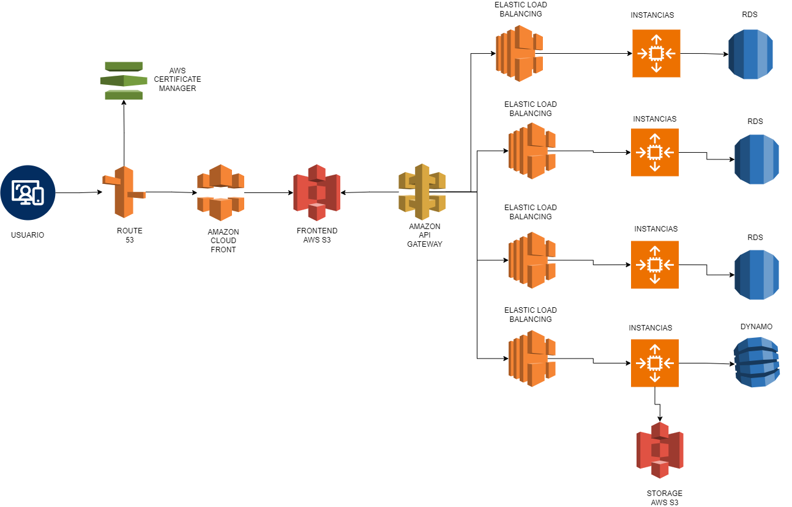
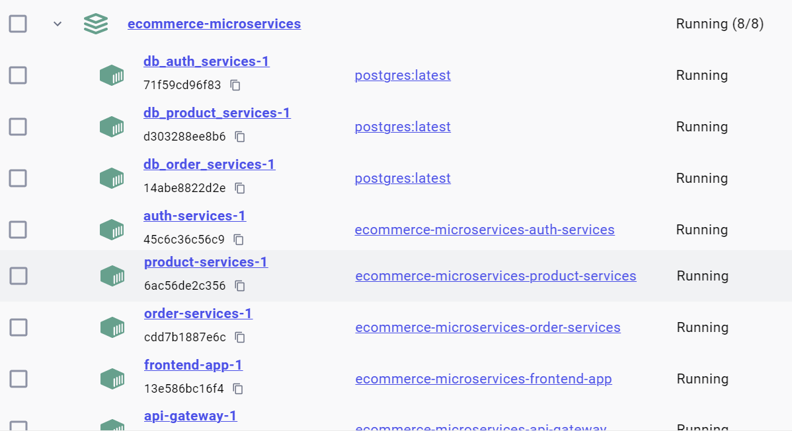
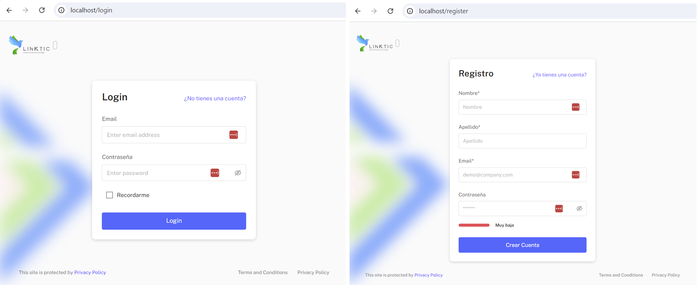
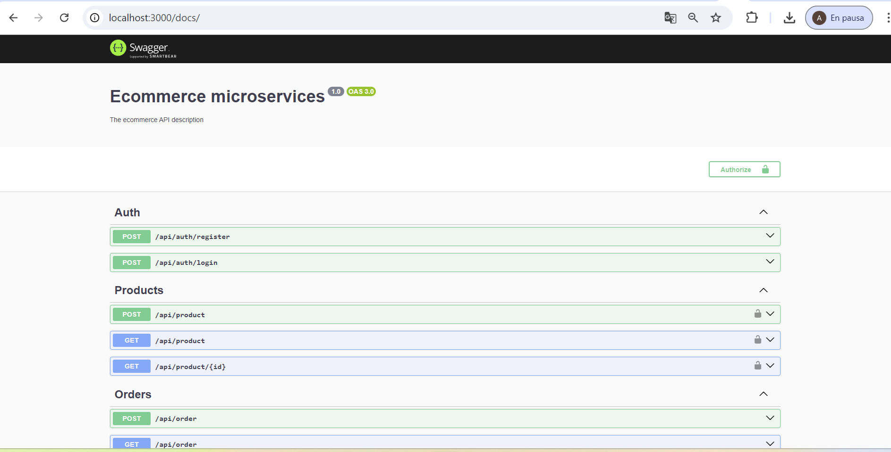

# Proyecto Ecommerce Microservices

# 1. App Planning (Architecture)


## Descripción

Este proyecto es una prueba técnica que implementa un sistema de ecommerce utilizando una arquitectura de microservicios. La aplicación está diseñada para ser escalable y modular, permitiendo la integración de diferentes servicios como autenticación, gestión de productos y órdenes.

Como se evidencia en el diagrama de arquitectura, es posible ejecutar cada servicio por independiente ya que cada microservicio posee la caracteristica de bajo acoplamiento.

Para efectos de la practica, solo se ha creado un repositorio. pero para un ambiente real, lo ideal seria que cada microservicio estuviera en un repositorio independiente, lo cual facilitaria su mantenibilidad y despliegue.

He seleccionado microservicios como arquitectura propuesta debido a que permite la alta disponibilidad y esta diseñada para plataforas robustas y con altos niveles de trafico. Adicionalmente su flexibilidad permite que la infraestructura de la aplicacion crezca a medida de la demanda y su escalabilidad sea lo mas transparente posible.

### Características

- **Microservicios**: Cada funcionalidad se encuentra en un servicio separado, lo que mejora la mantenibilidad y escalabilidad.
- **API Gateway**: Un punto de entrada único para todas las solicitudes, que se encarga de enrutar las peticiones a los servicios correspondientes.
- **Base de Datos**: Cada servicio puede tener su propia base de datos, lo que permite una mayor flexibilidad.

## Tecnologías Utilizadas

- **Nest.js**: Para el desarrollo del backend.
- **React.js**: Para el desarrollo del frontend.
- **TypeScript**: Para una mejor tipificación y desarrollo más robusto.
- **TypeORM**: Como ORM para abstraccion de la BBDD. y no depender de una tecnologia en concreto
- **Docker**: Para contenerización y despliegue.
- **PostgresSQL**: Base de datos para almacenamiento.


# 2. Cloud Design

Acontinuacion adjunto el diseño de la infraestructura en la nube, tomando como referencia el proveedor AWS.



Para la simulacion en local de la infraestructura, se genero un fichero docker-compose.yml por todo el proyecto, con el cual se levanta en local todos los contenedores necesarios para probar el aplicativo.

## Instalación

1. Clona el repositorio:
   ```bash
   git clone https://github.com/andres233/ecommerce-ms.git
    ```
2. Navega al directorio del proyecto

    ```
    cd ecommerce-ms
    ```

3. Para ejecutar la aplicación, utiliza Docker

    ```
    docker compose up --build
    ```

4. Tendras en local toda la aplicacion ejecutandose




## Recomendaciones

en el fichero `docker-compose.yml` se encuentran las variables de entorno de cada servicio y dentro de ellas, los puesrtos que deben estar habilitados para que la ejecucion del proyecto sea exitosa. Acontinuacion adjunto los puertos que tendran que estar disponibles en caso que se ejecute tal cual estan los environments.

### Puertos disponibles

| Servicio            | Puerto                                          |
|--------------------|------------------------------------------------------|
| Frontend App | 80 |
| Backend Api Gateway | 3000  |
| Backend Auth Services | 50051 |
| Backend Order Services | 50052  |
| Backend Product Services | 50053  |
| BBDD Auth Services | 5433 |
| BBDD Order Services | 5434 |
| BBDD Product Services | 5435 |


### Resultados esperados

Si todo ha ido bien en la url `http://localhost` estara disponible el frontend. Y desde alli se podran realizar las pruebas de los servicios basicos implementados.

- Registrar usuario
- Iniciar Sesion
- Crear Producto
- Listar productos
- Crear una venta
- Listar ventas




Adicionalmente se ha utilixado `swagger` para la documentacion de la API Rest y estara disponible en el puerto en el que se ejecuta el API Gateway en la ruta `/docs` 

```
http://localhost:3000/docs
```




# 3. Pipelines (DevOps)

Para la ejecucion de la prueba de CI/CD he optado por agregar el pipeline al Front, haciendo uso de los Github actions 

el fichero de .yml se encuentra en

[Frontend/ecommerce-andres/.github/workflows/prod.yml]

Es un despliegue basico de react.

- Primero se define los eventos que ejecutaran el worked que para este caso seran 
 un push a la rama master, o un pull request (closed) sobre la rama master

 - el job que se ejecutara, usara la imagen `ubuntu-latest` para realizar todo el proceso.
 - alli se instalara la ultima version del repositorio con el action `actions/checkout@v4`
 - En el paso siguiente se usa el action `actions/setup-node@v4` el cual permite tener disponible node para la ejecucion de los siguientes pasos
 - Con `npm version patch` aumentamos la version automaticamente del proyecto y en el ultimo paso se subo un commit automatico con este cambio
 - En el paso siguiente se instalan las dependecias con `npm install`
 - Se genera el compilado con `npm run build` el cual genera el directorio `/dist`
 - Y por ultimo se hace por medio de ssh y el action `easingthemes/ssh-deploy@v4` un deploy en el servidor configurado. se copia el directorio statico en un nginx del servidor.
 

